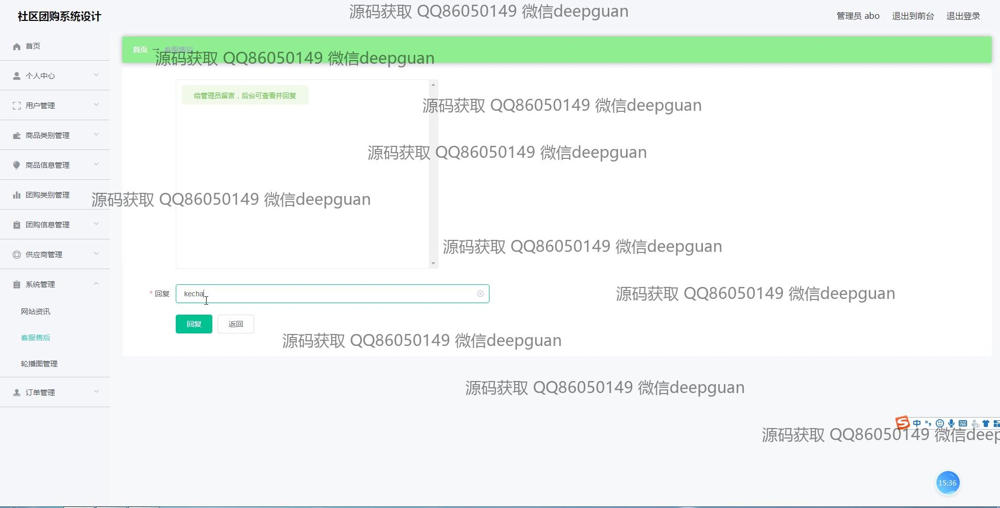

<h1 align="center">基于的社区团购系统设计</h1>

## 简介
基于Spring Boot的社区团购系统，角色分为管理员和用户；主要功能包括用户管理、商品管理、团购信息管理、订单管理、供应商管理和系统设置，支持商品浏览、团购参与、订单支付及社区互动，旨在提供简洁高效的团购体验。    --计算机毕业设计源码；毕设源码；java毕业设计源码

## 联系方式

<h3 align="center">获取完整代码与数据库文件 + 微信：deepguan QQ: 86050149 QQ群: 783742310</h3>

<h3 align="center">可帮忙远程部署 包运行成功！提供远程部署、修改代码、设计文档指导、代码讲解等服务！</h3>

## 功能介绍（完整见运行截图）
管理员：基本功能包括通过账户验证进行登录和管理操作，能够注册新管理员并注销账号。后台管理提供全面的系统控制，如用户管理、商品管理、供应商管理、以及团购信息管理。管理员可以编辑商品信息，包括上传图片、设置价格、库存、类别，并管理订单状态和用户反馈。系统支持文件上传、信息删除、更新，以及对管理页面进行定制和优化，以保障信息的精确性和操作的高效性。在管理界面中，管理员可以查看和更改系统资讯，如新闻、公告、政策等，通过富文本编辑工具进行格式调整。

用户：用户侧重于社区团购参与，在此系统中，用户可以通过简单注册和登录程序访问个人化的内容。主页提供商品信息、团购活动和个人账户的快速导航。用户能够浏览商品详情，使用购物车功能以选择商品并进行结算。个人中心允许查看和编辑个人信息，如收货地址、订单状态、收藏夹和历史交易记录，支持用户在线参与团购、追踪订单付款状态及优惠活动的选择。此外，用户还可以评论购买的商品，分享体验，与社区互动。

## 运行截图

本代码来源于网络,仅供学习参考使用!

